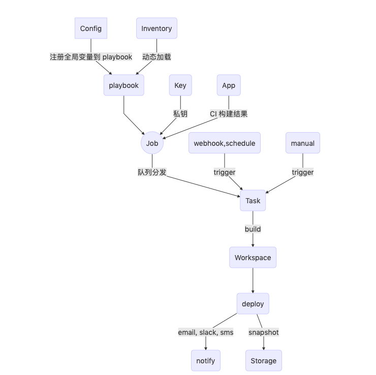

### eclogue

  

  eclogue（牧歌），基于 ansible 的 devops 平台。让 ansible 更简单易用，WYSIWYG，让持续交付更高效。

---

**注意** 当前版本仍处测试阶段请勿用于生产环境

**~~最初目的~~**：
- 提供一个 ansible tower(awx) 外更多选择 ansible web 平台（仅个人认为觉得 awx 太难掌控），不要再让 ansible 到处执行

### Feature
- 安装简单，除 mongodb， redis 外无任务附加依赖
- 更简单的 ansible-playbook 管理， 所见即所得， 动态 inventory 加载， 再无需挨个修改 inventory 文件
- 更好的日志追踪，让 ansible 任务有迹可循
- 更好配置管理，核心配置从注册中心自动注册至项目，隔离开发者与线上配置，再也不用担心程序员删掉数据库跑路了，不用担心 s3 bucket 有一天没了。
- 更便捷的持续部署，滚动更新， 秒级回滚历史任一版本，对接 jenkins, gitlab-ci, drone ...让 CI 做 CI 该做的事
- inventory 既是资产，更简单 cmdb 模型，哨兵巡逻，自动发现，自动报警
- 兼容 crontab 格式计划任务
- RBAC 权限模型

### 安装
- `pipenv shell`
- `pipenv install`
- `python manage.py migrate bootstrap  // 仅当第一次安装执行`
- `python manage.py start` // dev 运行运行
- `python run manage.py server` 使用 gevent 作为服务器
- 更多操作 `python manage.py --help`

### Docker
- 编辑 .env 文件设置 `ENV=docker`
- `docker-composer up` 访问 http://localhost:5000/
- 创建初始化数据,添加超级管理员 `docker-compose exec web pipenv run python manage.py bootstrap --username=admin --password=eclogue`

### 文档
[中文文档](http://doc.sangsay.com)|~~English~~

### Demo
[http://demo.ecloguelabs.com](http://demo.sangsay.com)

- `username`: natsume
- `password`: takashi

### 工作流程

### Community
QQ 群：362847712

### Contributing
[see](http://doc.ecloguelabs.com/#/contributing)

### License
GPL-3.0

