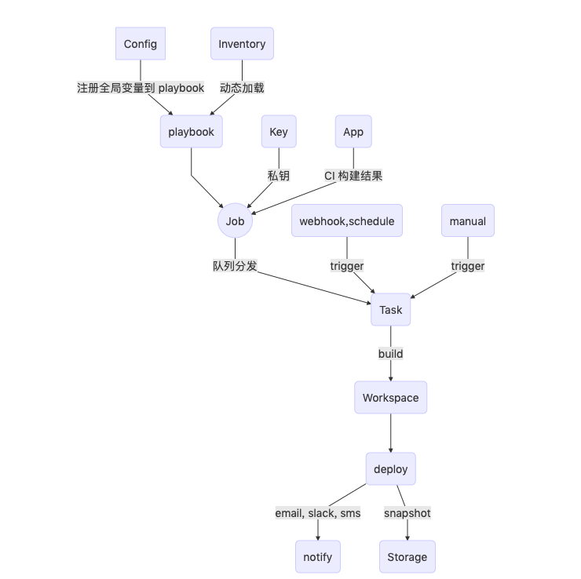

# Eclogue

  

  Eclogue is anisble web UI build on ansible. It make use ansible in a easy way, WYSIWYG. Eclogue integrated configure center, CI artifacts and cmdb. You can import playbook from git, galaxy, and local upload. Render configurations from config center and dynamic load hosts from DB, build separate space for every job.

**Notice** current version still in develop, don't deploy it in production environment.

### Feature
- Easier to use, you can use ansible[playbook] command like it work in terminal.
- All of executions should be reported and every history job can be relaunch alone from snapshot.
- Centralized configuration management by using config register center. Config items were encrypted and stored in configure center and dynamically render to playbook.

- Auto lint playbook and abort warning.
- Cooperate with jenkins, gitlab, git etc. Bind App with CI artifacts then auto download and register to playbook.
- More flexible CMDB model, everything ssh connected is resource.
- Crontab like sheduler.
- RBAC permission model.

### Install

use in local machine:

* install dependencies: `pip install -r > requirements.txt`
* composer-compose for db: `docker-compose -f docker/docker-compose-db.yaml up -d`
* dev server: `python manager.py start`
* product server: `python run manage.py server`
* worker: `python manager.py woker`
* for more command: `python manage.py --help`
* migrate and bootstrap: `python manage.py migrate bootstrap`

recommend use dokcer-compose for dev:

* run all: `docker-compose up -d`

visit: `http://localhost:5000/`

### Document

[中文文档](http://doc.sangsay.com)|~~English~~

### Demo
[http://demo.ecloguelabs.com](http://demo.sangsay.com)

- `username`: natsume
- `password`: takashi

### Diagram

### Contributing
give me your star or [see](http://doc.ecloguelabs.com/#/contributing)

### Community
QQ：362847712

### License
GPL-3.0
